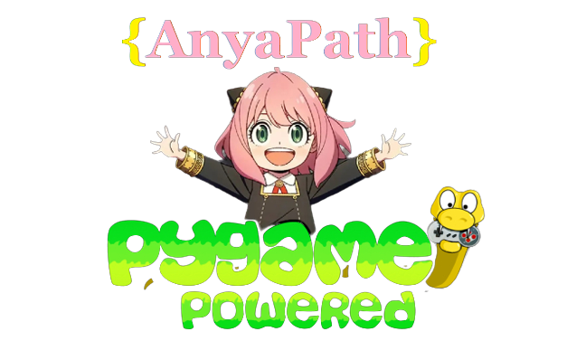
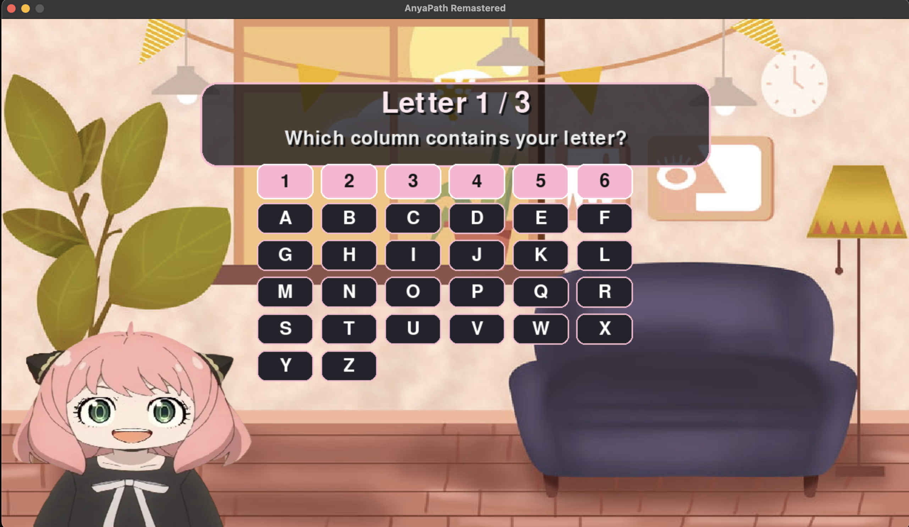
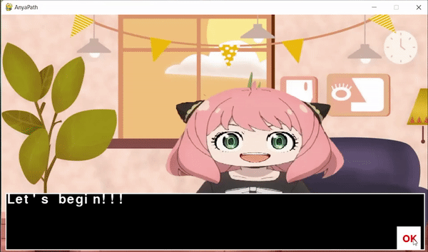

<p align="center">
  <a href="https://github.com/R37r0-Gh057/AnyaPath-Pygame">
    
  </a>
</p>

<h1 align="center">✨ AnyaPath Remastered ✨</h1>

<p align="center">
  <strong>Anya can read your mind... or can she? 👀</strong>
</p>

<p align="center">
  A remastered version of a college-era Pygame project built while learning the library in 2022.
</p>

<p align="center">
  
  
  
</p>

---

## 🎮 Gameplay Preview

<p align="center">
  
</p>

---

## 📖 About

**AnyaPath** is a small mind-reading game inspired by **Anya Forger** from *Spy × Family*, where Anya guesses any word you're secretly thinking of using a fun matrix-based trick.

This project was originally created in **2022 while learning Pygame during college**. Years later, I revisited it to refactor, redesign, and modernize the game while preserving the original gameplay idea.

The goal of this remaster was simple:

> Keep the charm of the original, but make the codebase and experience feel much more polished.

---

## 🔄 Original vs Remastered

<table align="center">
<tr>
<td align="center"><strong>Original (2022)</strong></td>
<td align="center"><strong>Remastered</strong></td>
</tr>
<tr>
<td>

</td>
<td>

</td>
</tr>
</table>

### ✨ What's Improved?

| Original | Remastered |
|----------|-------------|
| Monolithic structure | Cleaner modular architecture |
| Beginner-level Pygame code | Refactored & maintainable codebase |
| Basic UI | Improved visual styling |
| Hard-to-read text | Better readability & typography |
| Overlapping sprite placement | Cleaner layout and positioning |
| Same gameplay | Preserved original mechanics |

---

## 🕹️ How To Play

1. Think of **any word** in your mind.
2. Enter the **number of letters** in that word.
3. Anya will show a matrix of alphabets.
4. For each letter in your word:
   - Select the **column number** containing that letter.
5. Anya will generate a **new matrix**.
6. Repeat the process one more time.
7. Watch Anya reveal the exact word you were thinking of 👀

> If the result is incorrect, an incorrect column was likely selected at some point.

---

## 🧠 How The Magic Matrix Works

The game uses a simple but fun matrix trick to reconstruct your word.

### Step 1 — Initial Matrix

A matrix containing the alphabet is shown.

For every letter in your secret word, only the **column containing that letter** is selected.

Example word:

```txt
FISH
````

From the first matrix:

Selections:

* **F** → Column **6**
* **I** → Column **3**
* **S** → Column **1**
* **H** → Column **2**

Result:

```txt
[6, 3, 1, 2]
```

---

### Step 2 — Matrix Transposition

The selected columns are transposed to create a new matrix.

You repeat the same process:

* **F** → Column **1**
* **I** → Column **2**
* **S** → Column **4**
* **H** → Column **2**

Result:

```txt
[1, 2, 4, 2]
```

---

### Step 3 — Word Reconstruction

The selected columns are used row-by-row:

* Column **1** → Row **1**
* Column **2** → Row **2**
* Column **4** → Row **3**
* Column **2** → Row **4**

Result:

```txt
FISH
```

✨ Mind reading achieved.

---

## 🚀 Installation

### Option 1 — Run From Source

Clone the repository:

```bash
git clone https://github.com/R37r0-Gh057/AnyaPath-Pygame
```

Move into the project:

```bash
cd AnyaPath-Pygame
```

Install dependencies:

```bash
pip install pygame
```

Run the game:

```bash
python game.py
```

---

## 🛠️ Tech Stack

* **Python**
* **Pygame**

---

## 📁 Project Structure

```txt
AnyaPath-Pygame/
│── assets/
│   ├── sounds/
│   └── sprites/
│
│── game/
│   ├── animation.py
│   ├── audio.py
│   ├── game.py
│   ├── state.py
│   ├── ui.py
│   └── word_guesser.py
│
│── constants.py
│── game.py
│── requirements.txt
│── README.md
```
---

## 🎯 Future Improvements

* More sprite variations
* More Anya voice lines & reactions
* Additional UI polish
* Better support for very large words

---

## ❤️ Credits

Inspired by **Anya Forger** from **Spy × Family**.

Built with **Python + Pygame**.

Originally created in **2022**, remastered years later for fun, learning, and nostalgia ✨
