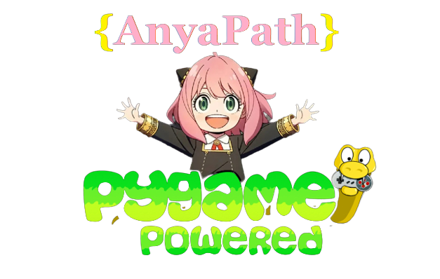

  

<h1>AnyaPath-Pygame</h1>

 
 

# Table of contents:
  - [Introduction](#introduction)
  - [How to play](#how-to-play)
  - [The Magic Matrix](#the-magic-matrix)
  - [Installation](#installation)
  - [Contributing](#contributing)
  - [To Do](#to-do)

# Introduction:
AnyaPath is made with Python (Pygame). In which [Anya Forger](https://spy-x-family.fandom.com/wiki/Anya_Forger) from [Spy x Family](https://en.wikipedia.org/wiki/Spy_%C3%97_Family) will find out any word that you have in mind without any mistakes using the [Magic Matrix method](#the-magic-matrix). (If you don't get the right result, then you must have given an incorrect input.)

# How to play:
* Anya will ask you to **provide the length (the number of letters)** of the word you have in mind.
* Anya will give you a **matrix** which contains all **alphabets**.
* For every letter of your word, You'll have to tell Anya which **column** has the **letter** in it. Just type the column number and click **'OK'** button to move on to the next letter.

* Anya will give you an **another matrix** which is different from the previous one, and you'll have to do the **same thing again** for the last time.

* In the end Anya will tell you the word you were thinking of. :D

# The Magic Matrix:
* In the Magic Matrix method, there is a matrix which contains all of the alphabets.
* In that matrix, only those columns that contain the letters of the word are selected in the continuos order.
* Then the selected columns are transposed to create another matrix.
* The same steps are repeated with this new matrix to get the columns that contain the letters.
* Finally, an element of every row of the columns are selected with incrementing the row number for each column. (See example below for better understanding.)

**EXAMPLE:**
Let's say our desired word is "FISH".

* From the below matrix we select the columns that contain the letters 'F', 'I', 'S', 'H':

  * We first select the **6th column**, since it has the **first** letter (**'F'**) of the word.
  * Then we select the **3rd column**, since it has the **second** letter (**'I'**) of the word.
  * Then we select the **1st column**, since it has the **third** letter (**'S'**) of the word.
  * And lastly, we select the **2nd column**, since it has the **fourth** letter (**'H'**) of the word.

* Now we transpose the selected columns to create a new matrix and repeat the same steps with it:

  * We first select the **1st column**, since it has the **first** letter (**'F'**) of the word.
  * Then we select the **2nd column**, since it has the  **second** letter (**'I'**) of the word.
  * Then we select the **4th column**, since it has the **fourth** letter (**'S'**) of the word.
  * And lastly, we select the **2nd column** again, since it has the **fourth** letter (**'H'**) of the word.

 * From the selected columns **[1, 2, 4, 2]** of the **new matrix**, we take **an element from each of those columns' rows** but we **keep incrementing the row number for a new column.**
    * From the **first column[1]**, we take the element from **row number 1.**
    * From the **second column[2]**, we take the element from **row number 2**.
    * From the **third column[4]**, we take the element from **row number 3**.
    * From the **fourth column[2]**, we take the element from **row number 4**.
* After selecting the elements, you will have the whole word.
# Installation:
* Windows: download the Executable from [here](https://github.com/R37r0-Gh057/AnyaPath-Pygame/releases/tag/v1.0.1) and run it.
* Other:
  * Install python
  * Install pygame module: `python -m pip install pygame`
  * Run the game: `python game.py`
 
# Contributing:
There is alot left to improve in the code. There are some current major known issues that need fixing:

* The background music doesn't play in a loop.
* Transpose Matrix created by a large word won't fit in the screen and matrix box height doesn't increase according to the length of the given word.
* On giving big words, the sentence length increases and the text goes out of the dialog box.
* The game freezes when the screen is clicked before a dialogue has finished displaying.

  * ## To do:
    * To make the game more fun:
      * Add more sprites
      * Add more sounds.
      * Add more Anya-like dialogues.
